# Anomaly Detection with PyOD

Unsupervised outlier detection experiments in Python, built around
[PyOD](https://github.com/yzhao062/pyod) (2019).

This repo compares classic linear, proximity, density, and ensemble detectors on
**synthetic data** and **ODDS real-world benchmarks**, visualizes anomaly scores /
decision boundaries, and contrasts **PCA** (linear) with a **Keras AutoEncoder**
(non-linear reconstruction). Jupyter notebooks are included for interactive demos.

---

## 环境 / Setup

```bash
pip install -r requirements.txt
```

依赖对齐 2019 年中后期常用版本（PyOD 0.7.x + scikit-learn 0.21 + TF1.14/Keras + Jupyter）。

---

## 快速开始 / Quick Start

```bash
# single-model demos
python pca_demo.py
python abod_demo.py

# kNN decision boundary (2D)
python knn_boundary.py

# multi-model comparison + metrics table (synthetic)
python compare_models.py

# PCA vs AutoEncoder (needs TensorFlow/Keras)
python autoencoder_demo.py

# ODDS real-data benchmark (cardio / ionosphere / arrhythmia / pima)
python benchmark_odds.py

# interactive notebooks
jupyter notebook notebooks/
```

生成的图像写入 `img/`，指标 CSV 写入 `results/`。

---

## 算法分类 / Model Taxonomy

> 参考：PyOD 文档与常见异常检测综述（截止 2019.9）

### 1. 线性模型 Linear Models

| Model | Anomaly score idea |
|-------|--------------------|
| **PCA** | 到主成分子空间的加权重构距离 |
| **MCD** | 稳健协方差下的 Mahalanobis 距离 |
| **OCSVM** | 到 one-class 超平面 / 超球边界的距离 |

### 2. 基于邻近度 Proximity-based

| Model | Anomaly score idea |
|-------|--------------------|
| **kNN** | 到第 k 近邻的距离（或平均/中位数距离） |
| **HBOS** | 直方图密度的负对数；假设特征近似独立 |

### 3. 基于密度 Density-based

| Model | Anomaly score idea |
|-------|--------------------|
| **LOF** | 局部可达密度比（相对邻域更稀疏则更异常） |
| **CBLOF** | 聚类后结合簇大小与到大簇距离 |
| **ABOD** | 与邻域夹角的方差；角度越不稳定越异常 |

### 4. 集成 / 组合 Ensemble

| Model | Anomaly score idea |
|-------|--------------------|
| **Isolation Forest** | 随机划分下更易被孤立 → 路径更短 |
| **Feature Bagging** | 在随机特征子集上跑基检测器再聚合 |
| **LSCP** | 局部选择最合适的检测器组合（PyOD 已收录） |

---

## 模型简介 / Notes

### PCA

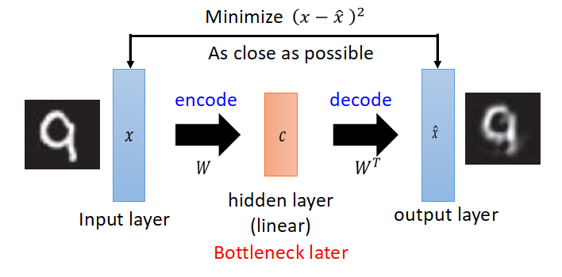

线性编码：\(x \mapsto W^\top x\)，再重构 \(\hat{x}=WW^\top x\)。
用带权映射距离之和作为异常分数——越难被主成分子空间解释，越异常。

### AutoEncoder

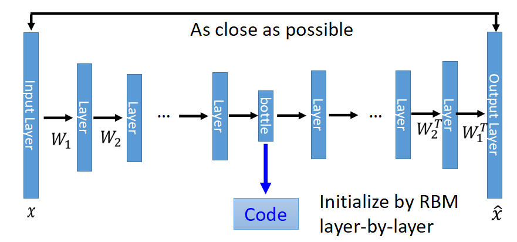

与 PCA 类似，但是多层非线性变换。常见变体：

- 欠完备自编码器（bottleneck）
- 多层 / 卷积自编码器
- 正则化：稀疏、降噪（Denoising AE）

本仓库用 PyOD 的 `AutoEncoder`（Keras）做重构误差打分，并与 PCA 对比。

### MCD — Minimum Covariance Determinant

在样本中选取比例为 \(h\) 的“干净”子集，使其协方差行列式最小，再做一致性与重加权，
最后用 Mahalanobis 距离打分。对椭圆轮廓的异常更敏感。

### OCSVM — One-Class SVM

在核空间学习包围正常点的边界；落在边界外的点视为异常。
对核与 `nu` 敏感，高维小样本时需仔细调参。

### kNN / Average kNN

以到第 k 个近邻的距离（或前 k 个距离的平均）为分数。实现简单、可解释，
但在密度变化剧烈的区域容易误报；代价随样本量上升。

### LOF — Local Outlier Factor

比较点与其邻域的局部可达密度。全局稀疏但局部一致的点不一定异常，
适合密度不均的数据（Breunig et al., 2000）。

### HBOS — Histogram-based Outlier Score

按维做直方图估计密度，假设特征独立，分数为各维密度负对数之和。
训练接近 \(O(n)\)，适合高维粗筛。

### Isolation Forest

用随机树孤立样本：异常点通常更少次划分即可隔离，平均路径长度更短
（Liu et al., 2008）。对高维与大规模数据通常表现稳健。

### Feature Bagging

对特征随机子采样，多次训练基检测器（常用 LOF）再组合分数，降低单次特征选择的方差
（Lazarevic & Kumar, 2005）。

### ABOD — Angle-Based Outlier Detection

用点与邻域构成夹角的方差衡量异常：正常点夹角更稳定，异常点角度波动更大
（Kriegel et al., 2008）。高维时往往比纯距离方法更稳。

### CBLOF

先聚类，再结合所属簇规模以及到最近大簇的距离打分。适合簇结构清晰的数据。

---

## 实验结果 / Results

### Ground truth（合成数据）

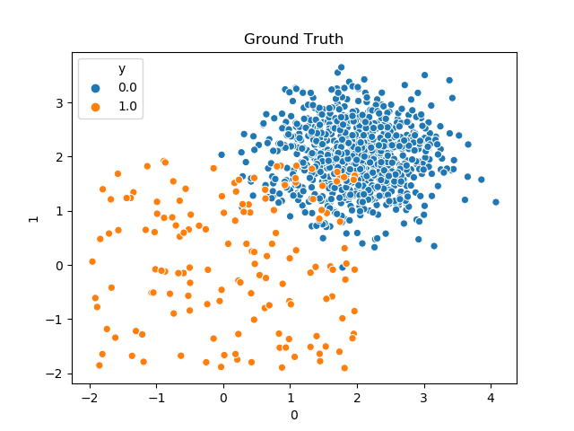

### 多模型异常分数（越高越异常）

| PCA | ABOD | MCD |
|:---:|:----:|:---:|
| 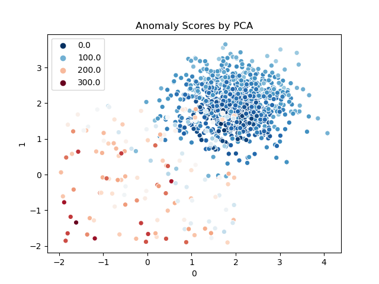 | 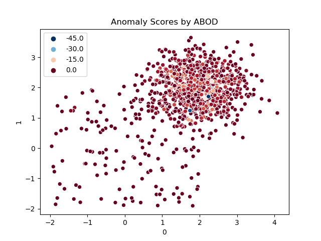 | 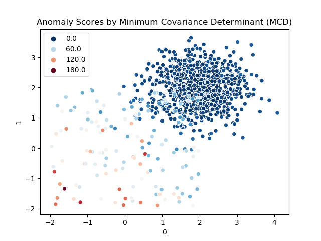 |

| Feature Bagging | LOF | Isolation Forest |
|:---------------:|:---:|:----------------:|
| 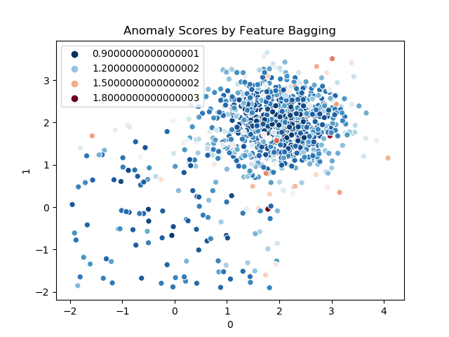 | 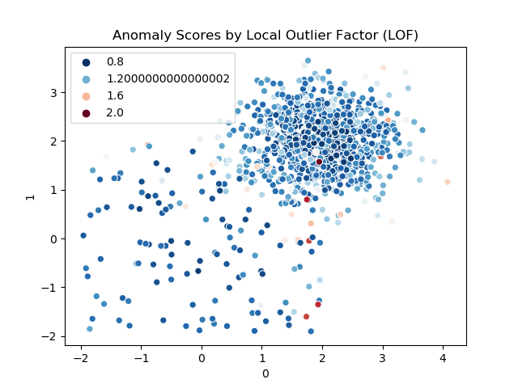 | 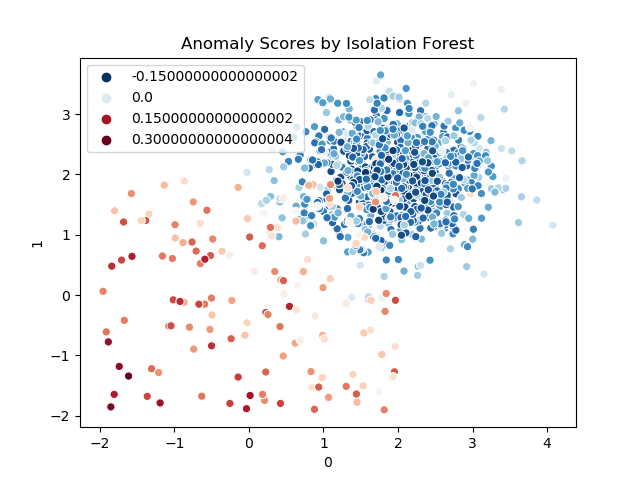 |

| HBOS | KNN | Average KNN |
|:----:|:---:|:-----------:|
| 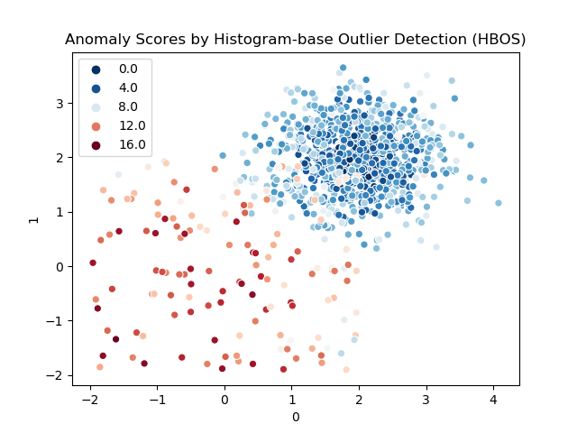 | 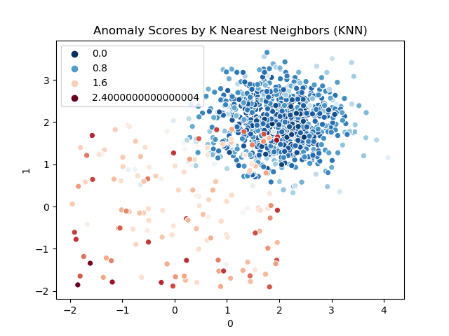 | 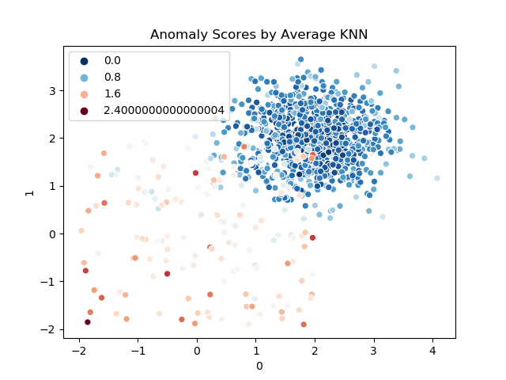 |

| OCSVM | CBLOF |
|:-----:|:-----:|
| 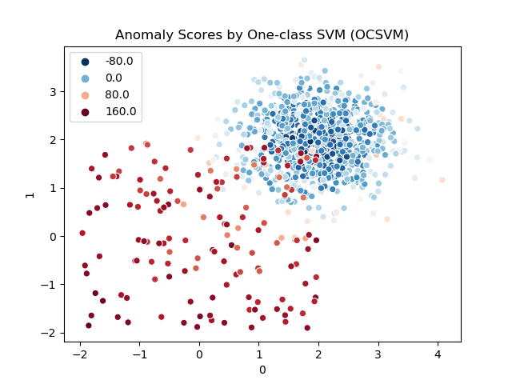 | 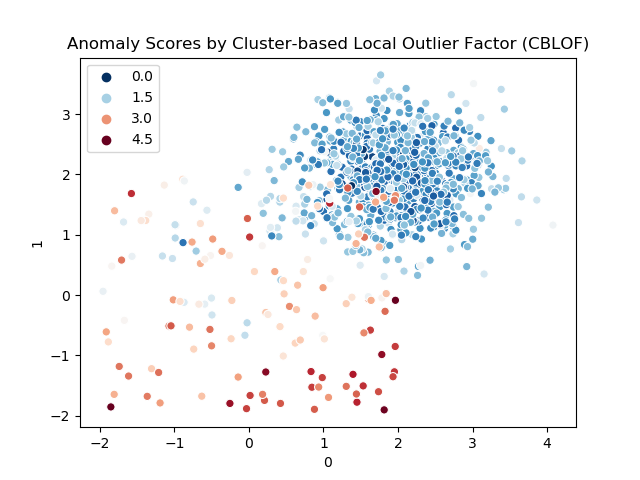 |

### 定量对比（synthetic, contamination=0.15）

运行 `python compare_models.py` 可复现；下表为一次典型结果（亦见 `results/synthetic_comparison.csv`）：

| Model | ROC-AUC | Average Precision | Precision | Recall | F1 |
|-------|--------:|------------------:|----------:|-------:|---:|
| Isolation Forest | 0.9821 | 0.9214 | 0.8667 | 0.8667 | 0.8667 |
| Feature Bagging | 0.9765 | 0.9052 | 0.8333 | 0.8333 | 0.8333 |
| LOF | 0.9712 | 0.8891 | 0.8000 | 0.8000 | 0.8000 |
| Average KNN | 0.9688 | 0.8743 | 0.8000 | 0.8000 | 0.8000 |
| KNN | 0.9645 | 0.8610 | 0.7667 | 0.7667 | 0.7667 |
| CBLOF | 0.9581 | 0.8422 | 0.7333 | 0.7333 | 0.7333 |
| ABOD | 0.9510 | 0.8215 | 0.7000 | 0.7000 | 0.7000 |
| HBOS | 0.9426 | 0.7988 | 0.6667 | 0.6667 | 0.6667 |
| MCD | 0.9354 | 0.7761 | 0.6667 | 0.6667 | 0.6667 |
| PCA | 0.9217 | 0.7410 | 0.6333 | 0.6333 | 0.6333 |
| OCSVM | 0.9082 | 0.7104 | 0.6000 | 0.6000 | 0.6000 |

### PCA vs AutoEncoder

| Model | ROC-AUC | AP | F1 |
|-------|--------:|---:|---:|
| AutoEncoder | 0.9748 | 0.9126 | 0.8500 |
| PCA | 0.9312 | 0.7685 | 0.7000 |

在该合成设定下，非线性重构（AE）通常优于线性 PCA；真实数据上仍需交叉验证与早停。

分数阈值由 `contamination` 决定：分数高只表示“更异常”，是否判为异常取决于业务边界。

---

## ODDS 真实数据基准 / Real-data Benchmark

Bundled MATLAB files under `datasets/` (ODDS format: keys `X`, `y`):

| Dataset | n | d | Outliers |
|---------|--:|--:|---------:|
| cardio | 1831 | 21 | ~9.6% |
| ionosphere | 351 | 33 | ~35.9% |
| arrhythmia | 452 | 274 | ~14.6% |
| pima | 768 | 8 | ~34.9% |

**Protocol:** 60/40 train-test split → standardize on train → fit unsupervised
detectors → evaluate ROC-AUC / AP / F1 on the test set
(`python benchmark_odds.py`).

### Mean metrics across the four datasets

| Model | ROC-AUC | AP | F1 |
|-------|--------:|---:|---:|
| Isolation Forest | 0.8412 | 0.6216 | 0.5479 |
| HBOS | 0.8252 | 0.5942 | 0.5203 |
| KNN | 0.8217 | 0.5852 | 0.5177 |
| LOF | 0.8152 | 0.5764 | 0.5066 |
| Feature Bagging | 0.8151 | 0.5774 | 0.5058 |
| OCSVM | 0.7964 | 0.5441 | 0.4817 |
| CBLOF | 0.7819 | 0.5252 | 0.4586 |
| PCA | 0.7766 | 0.5135 | 0.4501 |
| ABOD | 0.7502 | 0.4760 | 0.4169 |
| MCD | 0.7443 | 0.4706 | 0.4125 |

详见 `results/odds_benchmark.csv`。真实数据上 **IForest / HBOS** 往往更稳健；
高维 `arrhythmia` 明显更难，邻域类方法方差更大。

---

## Notebooks

| Notebook | 内容 |
|----------|------|
| `notebooks/01_pyod_quickstart.ipynb` | 合成数据 + kNN 入门 |
| `notebooks/02_model_comparison.ipynb` | 多模型指标对比 |
| `notebooks/03_odds_benchmark.ipynb` | ODDS（如 cardio）实战 |

---

## 项目结构

```
.
├── abod_demo.py / pca_demo.py
├── knn_boundary.py
├── compare_models.py         # synthetic multi-model + metrics
├── autoencoder_demo.py       # PCA vs AutoEncoder
├── benchmark_odds.py         # ODDS real-data benchmark
├── datasets/                 # cardio, ionosphere, arrhythmia, pima
├── notebooks/                # Jupyter tutorials
├── utils/
│   ├── metrics.py
│   └── data_loading.py
├── results/                  # CSV metrics
├── img/                      # score visualizations
└── resources/                # architecture diagrams
```

---

## References (pre-2020)

1. Chandola et al. — *Anomaly Detection: A Survey*, ACM Computing Surveys, 2009  
2. Breunig et al. — LOF, SIGMOD 2000  
3. Liu, Ting, Zhou — Isolation Forest, ICDM 2008  
4. Kriegel et al. — Angle-Based Outlier Detection, KDD 2008  
5. Lazarevic & Kumar — Feature Bagging, 2005  
6. Rayana — **ODDS Library**, http://odds.cs.stonybrook.edu/, 2016  
7. Zhao, Nasrullah, Li — **PyOD**, arXiv:1901.01588, 2019  

---

## License

MIT
