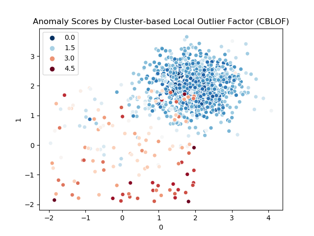

### 异常检测 Anomaly Detection
这个repository主要用于记录学习过程中遇到的和异常检测相关的算法模型，以及基于这些模型的一些实践。

对于python使用者来说，**Pyod**是一个可用于对多元数据进行异常检测的**python工具包**，当前涵盖了大量主流的异常检测算法，包括有监督学习、无监督学习、集成检测、基于神经网络的检测等。当前（2019.9）主要会使用这个库的一些方法对现有数据集进行异常检测，之后会根据场景使用其他toolkit。

在这对异常检测模型进行一个简单的分类

1. 异常检测的线性模型
	- PCA: Principal Component Analysis 主成分分析（使用到特征平面的带权映射距离之和作为异常分数）
	- MCD: Minimum Covariance Determinant （使用mahalanobis距离作为异常分数）
	- OCSVM: One-Class Support Vector Machines

2. 基于临近度的模型
	- kNN: k Nearest Neighbors (使用到最近k个临近点的距离作为异常分数)
	- Median kNN Outlier Detection (使用到最近k个临近点的中间距离作为异常分数)
	- HBOS: Histogram-based Outlier Score

3. 基于密度的模型
	- LOF: Local Outlier Factor
	- CBLOF: Clustering-Based Local Outlier Factor
	- ABOD: Angle-Based Outlier Detection

4. 集成和组合的框架
	- Isolation Forest
	- Feature Bagging
	- LSCP

***

### Performance by Pyod

> Training data GroundTruth

> PCA Anomaly Scores

>  ABOD Scores

>  MCD Scores

>  Feature Bagging Scores

> Local Outlier Factor (LOF)  Scores

> Isolation Forest Scores

> HBOS  Scores

> KNN  Scores

> Average kNN Scores

> OCSVM Scores

> CBLOF Scores

