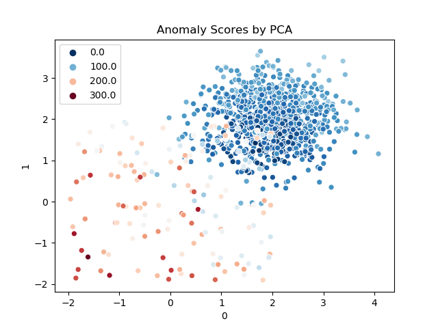
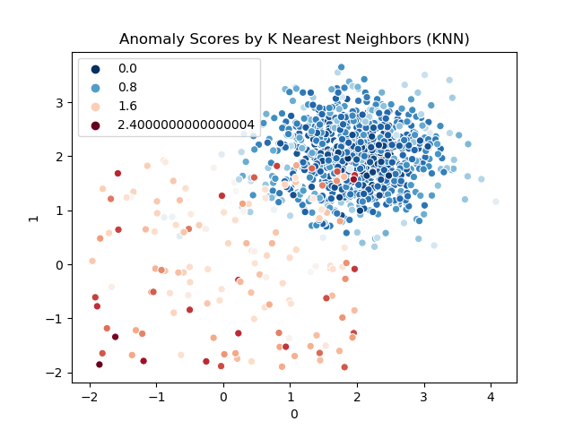

### 异常检测 Anomaly Detection
这个repository主要用于记录学习过程中遇到的和异常检测相关的算法模型，以及基于这些模型的一些实践。

对于python使用者来说，**Pyod**是一个可用于对多元数据进行异常检测的**python工具包**，当前涵盖了大量主流的异常检测算法，包括有监督学习、无监督学习、集成检测、基于神经网络的检测等。当前（2019.9）主要会使用这个库的一些方法对现有数据集进行异常检测，之后会根据场景使用其他toolkit。

***

> Note: 摘抄自[PYOD](https://github.com/yzhao062/pyod)作者在知乎上对问题“[数据挖掘中常用的「异常检测」算法有哪些](https://www.zhihu.com/question/280696035)”的回答（知乎id:微调），对异常检测领域涉及的算法做了一个非常好的总结，启发很大，搬运过来存档。
[点击查看](resources/outlierDetectionSummary.jpg)

***

在这对异常检测模型进行一个简单的分类

1. 异常检测的线性模型
	- PCA: Principal Component Analysis 主成分分析（使用到特征平面的带权映射距离之和作为异常分数）
	- MCD: Minimum Covariance Determinant （使用mahalanobis距离作为异常分数）
	- OCSVM: One-Class Support Vector Machines

2. 基于临近度的模型
	- kNN: k Nearest Neighbors (使用到最近k个临近点的距离作为异常分数)
	- Median kNN Outlier Detection (使用到最近k个临近点的中间距离作为异常分数)
	- HBOS: Histogram-based Outlier Score

3. 基于密度的模型
	- LOF: Local Outlier Factor
	- CBLOF: Clustering-Based Local Outlier Factor
	- ABOD: Angle-Based Outlier Detection

4. 集成和组合的框架
	- Isolation Forest
	- Feature Bagging
	- LSCP
	

***
### 异常检测常用模型简介

#### PCA Principal Component Analysis 主成分分析

原向量x乘以矩阵W得到中间编码c（这个过程是**线性的**），再乘以W的转置，得到x head,我们希望x head和x尽可能的接近。

#### AutoEncoder 自编码神经网络
自编码神经网络属于无监督学习，让计算机自己发现输入数据间的规律。和PCA类似，只是中间的网络层数更深，encode的变换是非线性的（加入**非线性**激活函数）

* 欠完备的自编码器 
* 多层自编码器
* 卷积自编码器
* 正则化自编码器
	- 稀疏自编码器
	- 降噪自编码器

#### MCD - Minimum Covariance Determinant 
找出一个给定比例（h）的 “好” 观察值，它们不是离群值， 且可以计算其经验协方差矩阵。 然后将该经验协方差矩阵重新缩放以补偿所执行的观察选择（”consistency step(一致性步骤)”）。 计算最小协方差决定估计器后，可以根据其马氏距离（Mahalanobis distance）给出观测值的权重， 这导致数据集的协方差矩阵的重新加权估计（”reweighting step(重新加权步骤)”）

#### OCSVM - One-class SVM 
参考[这个](https://www.cnblogs.com/wj-1314/p/10701708.html)

#### kNN - k Nearest Neighborhood 
参考[这个](https://www.cnblogs.com/jyroy/p/9427977.html)

#### LOF - Local Outlier Factor
参考[这个](https://blog.csdn.net/wangyibo0201/article/details/51705966)

#### HBOS - Histogram-base Outlier Detection

#### Isolation Forest

#### Feature Bagging

***

### Performance by Pyod

> Training data GroundTruth

> PCA Anomaly Scores

>  ABOD Scores

>  MCD Scores

>  Feature Bagging Scores

> Local Outlier Factor (LOF)  Scores

> Isolation Forest Scores

> HBOS  Scores

> KNN  Scores

> Average kNN Scores

> OCSVM Scores

> CBLOF Scores

anomalyScore越高就表示这个点异常程度就越大，至于将哪些点定位异常值，这取决于我们如何划定边界
